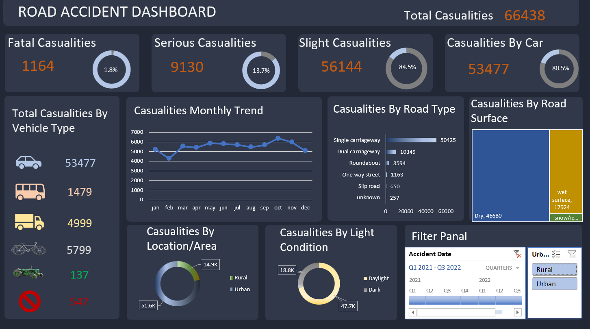

🚦 Road Accident Analysis Dashboard

📊 Project Overview
This project presents an interactive Excel dashboard analyzing road accident data to identify trends, casualty severity, vehicle impact, and road conditions.

The dashboard is built using Pivot Tables, KPI metrics, slicers, and advanced Excel visualizations.

📌 Key Insights
Total Casualties: 66,438

Fatal Casualties: 1,164
Serious Casualties: 9,130
Slight Casualties: 56,144
Majority accidents occurred on Single Carriageways
Most casualties occurred during Daylight
Urban areas reported higher accidents compared to rural areas

📈 Dashboard Features
KPI Cards
Monthly Trend Analysis
Vehicle Type Analysis
Road Type & Surface Analysis
Light Condition Analysis
Area-wise Comparison
Interactive Filter Panel

🛠 Tools Used
Microsoft Excel
Pivot Tables
Slicers
Conditional Formatting
Treemap Charts
Donut Charts
Data Cleaning Techniques

📷 Dashboard Preview

🎯 Skills Demonstrated
Data Cleaning
Data Modeling
Data Visualization
Business Insight Generation
Dashboard Design
